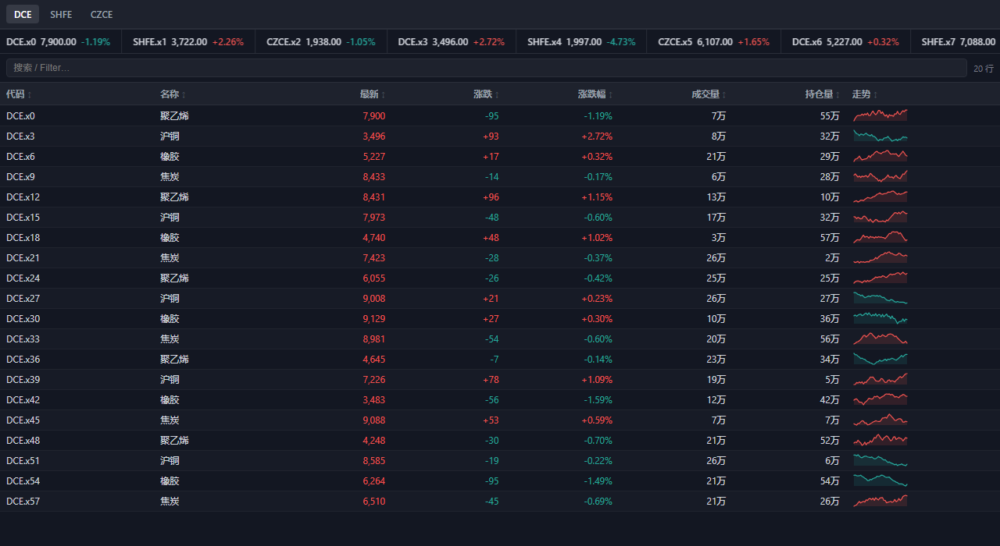
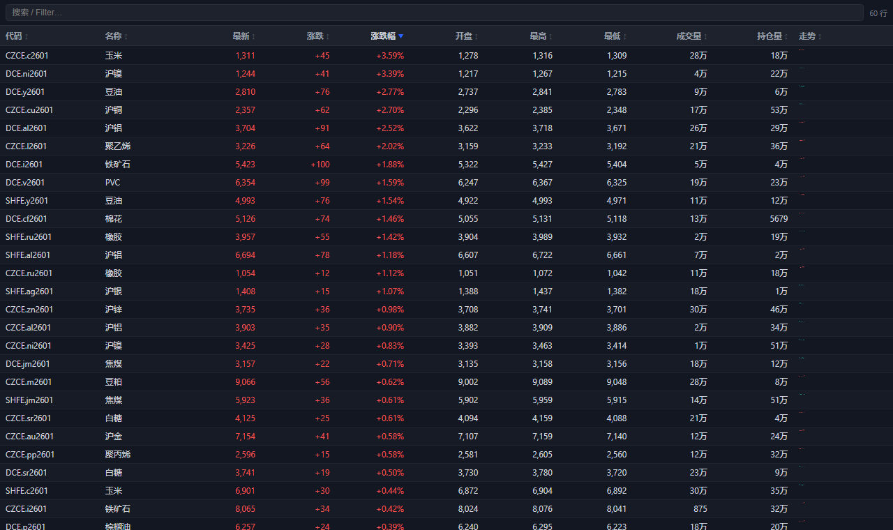
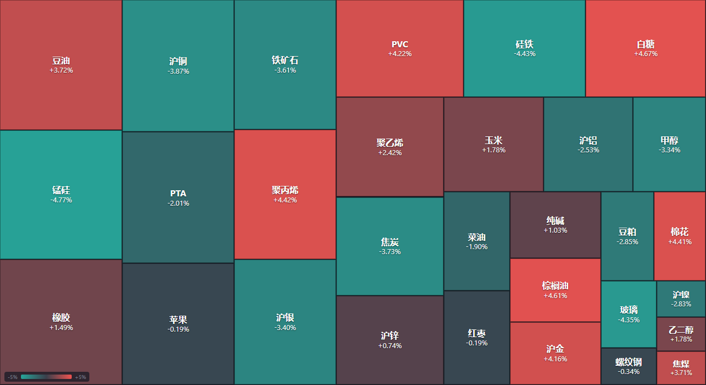
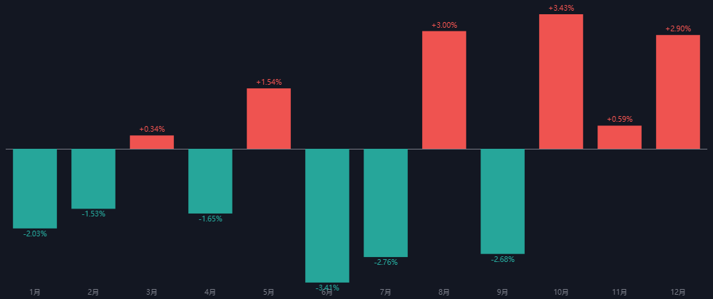
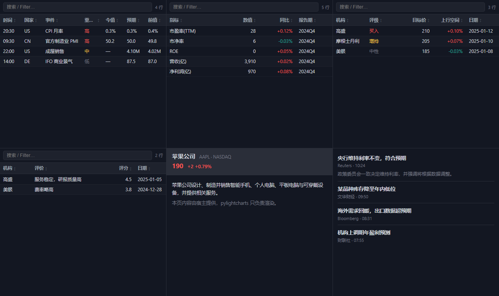
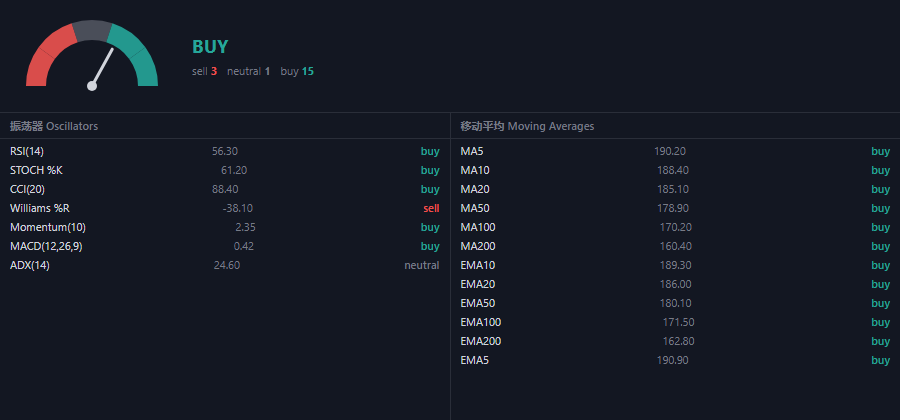

# 13 · Panels — 行情插件（DataGrid / Sparkline / Ticker / Quote / Heatmap / Seasonal / Screener）













本目录是「TradingView 金融插件」的第一批组件，落在 pylightcharts 之上、
**通用组件进库、业务数据进 miniqt**：

- **`DataGrid`** —— 可排序 / 搜索 / 虚拟滚动的数据表，内置数字、百分比、涨跌、
  行内迷你图等列类型；
- **`Sparkline`** —— 单 `<canvas>` 迷你走势，一行一个、几百个也不卡；
- **`QtPanel`** —— 一个**没有图表引擎**的 Qt WebEngine 页面，用来承载整页的
  DOM 面板（和 `QtChart` 同构，走同一套桥 / 主题 / 脚本队列）。

## 运行

```bash
python examples/13_panels/01_data_grid.py          # 整页行情表（800 行）
python examples/13_panels/01_data_grid.py --snapshot data_grid.png
python examples/13_panels/02_sparkline.py          # 迷你走势（含实时重画）
python examples/13_panels/03_market_data.py        # 分组行情表 + 顶部滚动条
python examples/13_panels/04_ticker_and_quote.py   # Ticker 家族 + 报价头
python examples/13_panels/05_heatmap.py            # 树状热力图
python examples/13_panels/06_seasonal.py           # 季节性柱状图
python examples/13_panels/07_screener.py           # 条件筛选表（Tabs 预设 + FilterBar）
python examples/13_panels/08_details.py            # P3 壳（日历/基本面/券商/资料/新闻）
python examples/13_panels/09_technical.py          # Technical Analysis（仪表盘 + 汇总）
python examples/13_panels/10_gallery.py            # 插件总览（全部插件网格；QtChart + QtPanel）
```

需要 PySide6 或 PyQt6（`PYLIGHTCHARTS_QT=PyQt6` 可切换）。

## 组件一览

| 类 | 说明 |
|---|---|
| `DataGrid` / `Column` | 可排序 / 搜索 / 虚拟滚动的数据表 |
| `Sparkline` / `MiniChart` | canvas 迷你走势 |
| `Tabs` | 分组切换条 |
| `MarketData` | `DataGrid` + `Tabs`（交易所/板块分组） |
| `Watchlist` | `DataGrid` 预设 + add / update / remove |
| `Ticker`（`TickerTape`/`TickerTag`/`SingleTicker`/`Tickers`） | 滚动/静态报价条 |
| `QuoteHeader`（`SymbolInfo`/`SymbolOverview`） | 报价头 |
| `Heatmap`（`StockHeatmap`/`CryptoHeatmap`/`EtfHeatmap`/`ForexHeatmap`） | 树状热力图（面积=权重、颜色=涨跌） |
| `SeasonalChart` + `seasonal_monthly` | 季节性柱状图 + 按月聚合辅助 |
| `Screener` | `DataGrid` + 多条件过滤（Python 侧） |
| `TechnicalAnalysis` + `ta_summary` | 买卖仪表盘 + 振荡器/均线汇总表 |
| `10_gallery.py` | 把上面全部插件按 TradingView 目录顺序铺成一张可滚动网格（Advanced Chart 用真实 `QtChart`） |
| `FilterBar` | 筛选条件 chips（可内联添加），与 `Screener` 双向同步 |
| `NewsFeed` / `TopStories` | 新闻头条列表 |
| `TextBlock` | 富文本/HTML 块（简介、说明） |
| `EconomicCalendar` / `FundamentalData` / `CompanyProfile` / `BrokerRating` / `BrokerReviews` | P3 壳（结构就绪，宿主喂数据） |

## 最小用法

```python
from pylightcharts import QtPanel
from pylightcharts.panels import Column, DataGrid

panel = QtPanel()                      # 或复用一张图的窗口：DataGrid(chart.win, ...)
grid = DataGrid(panel.win, columns=[
    Column('symbol', '代码'),
    Column('last', '最新', type='number', color_by='sign'),
    Column('chg_pct', '涨跌幅', type='percent'),
    Column('volume', '成交量', type='number', compact=True),   # 万 / 亿
    Column('spark', '走势', type='spark'),
])
grid.set_rows(rows)                    # rows: list[dict]
grid.on_row_double_click(lambda key: open_chart(key))
panel.get_webview().show()
```

## 关键点

| 能力 | 说明 |
|---|---|
| 列类型 | `text` / `number` / `percent` / `change` / `spark` |
| 数字格式 | `compact=True` → `万` / `亿`；`decimals=` 控制小数位 |
| 配色 | `color_by='sign'` + `color_scheme='cn'`（红涨绿跌）/ `'tv'`（绿涨红跌） |
| 交互 | 点表头排序、左上角搜索框过滤、`grid.sort()` / `grid.set_filter()` |
| 虚拟滚动 | 只有可见的几十行在 DOM 里（几千行不卡） |
| 回调 | `on_row_click` / `on_row_double_click` 收到行的 `row_key` 值 |
| 主题 | `Win.theme('light'/'dark')` 时表格自动跟随 |

> 接真实数据只需把 `make_rows()` 换成天勤 `tq_api.query_quotes(...)` 或
> `minibt.LocalDatas` —— 面板只负责画，不掺业务。

## 下一个是什么

`MarketData` / `Watchlist` / `TickerTape` 等成品组件由这些原语组合而来，
见 `minibt_docs/docs/minibt_miniqt/6.10_tradingview_widgets_plan.md` 的 P1 路线图。
